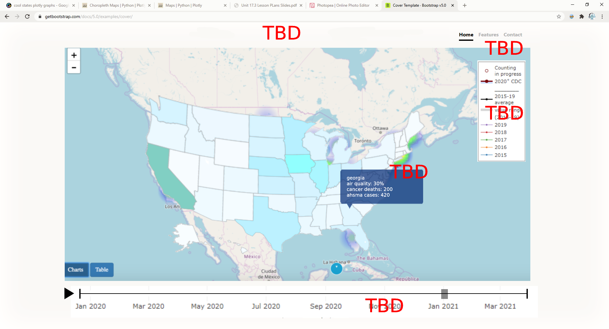
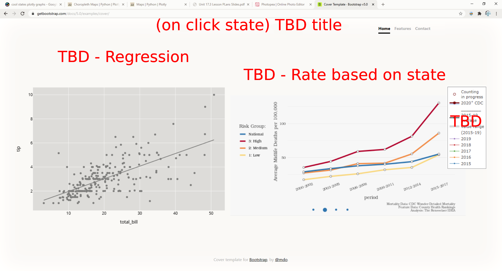
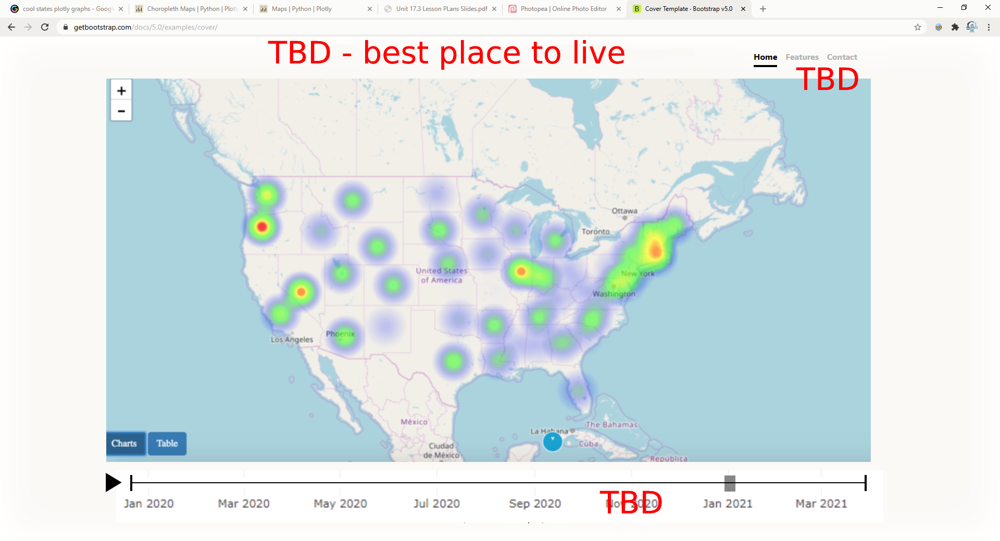
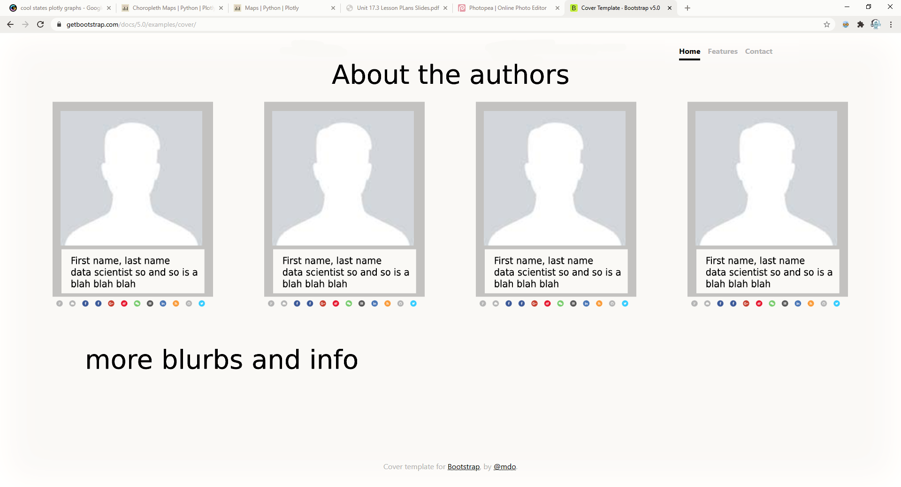
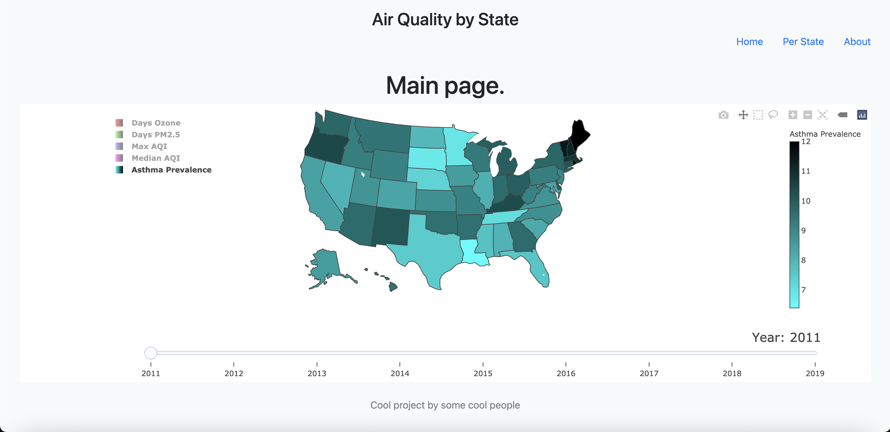
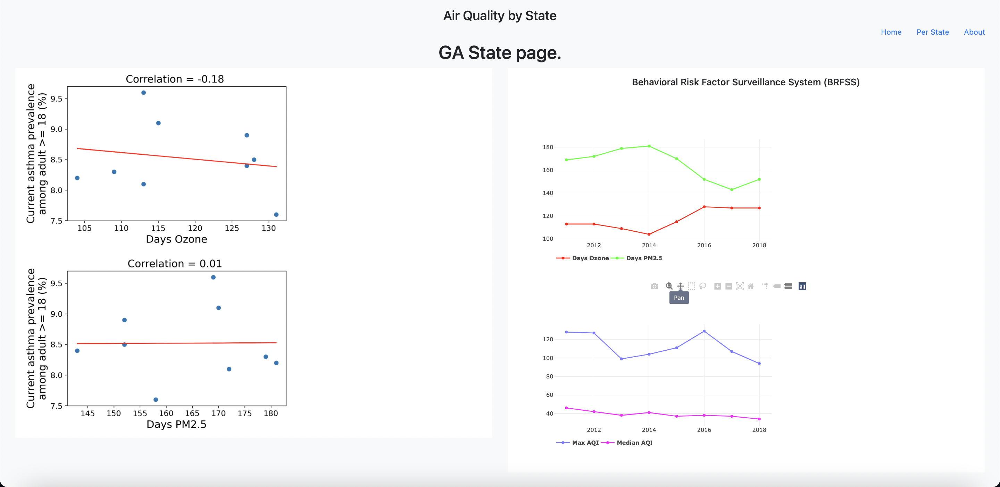

# environment-impact-health

# Project Goal
_Exploratory data analysis_ of air quality and asthma prevalence in the adult population of the United States.
#(Dashboard and visualizations to explore air quality and its health effects in the United States.)
# Introduction
Asthma is a chronic inflammatory disease of the airways whose characteristic symptoms are: wheeze, syspnoea, cough and chest thightness associates with variable expiratory airflow limitation. Data showed that air pollution has a negative impact on asmatic conditions in both adults and children [1].
The exposure to air pollution represent a significant risk factor for asthma development in children. However, a causal relation between air pollution and development of adult asthma is not established [2-3]. \
Air pollutants can be divided in gaseous and particulate matter (PM) according to their particle size and physical state. PM are the pollutants with the greatest impact on humans health [1].\
The air quality goodness is described for the public using the Air Quality Index (AQI) which retrieval change from country to country [4]. It is calculated by using the highest index pollutant among ground-level ozone, PM, carbon monoxide, sulfur dioxide and nitrogen dioxide [4-5].

# Instructions

Make sure to run the flask app by changing directory into the main project folder and running:
```bash 
python app.py
```

# Wireframe Goals

These are the agreed upon wireframes for the dashboard we want to use. All these graphs and data are subject to change based on data availability and scope.

### MainPage


 
The Main page shows the overview of the states with time as the slider at the bottom. When a user hovers over the state, the user can see some info for that specific state. When the user clicks the state, the user will be redirected to the individual Per State Page. There is a legend that the user can click to reduce the amount of data displayed on the graph, allowing data to be visually filtered. Lastly we want to have a play button on the bottom date time slider to allow the user to view the data as time passes.



This PerStatePage shows the regression data for the state as well as more state specific graphs that can also be filtered to show different data.



This LiveWellsStates page is our attempt to create a "so what?" answer with our data, allowing the findings to inform the user.



Check us out!

# Flask Structure and final product developed
```
/
```

Dashboard showing the info-graphics created to show the health and environment trends with respect to the time.\
Clicking on one state of the map will redirect you to another webpage:

```
/state/<state>"
```

In each state page, the linear regressions, between the cumulative asthma prevalence in the adult population with respect to the high pollution days (PM2.5 and Ozone) are reported along with two linear plots showing the trend of the high pollution days for PM2.5 and Ozone, and the trend of the maximum and median air quality index per year.


```
@app.route("/about")
```


# Exploratory analysis conclusions and future outcomes
* The exploratory data analysis showed that there is **not** a clear linear correlation between asthma prevalence in adults and the days with high PM2.5 and ozone pollution.
* A correlation between asthma episodes and air pollution (i.e. more acute asthma on high pollution summer date) is reported in the scientific literature [1-4], hence the _possible linear correlation between asthma hospitalization and air pollution_ will be evaluated in the future.
* The _future explanatory data analysis_ aims to highlight what are the best states to live in for people who suffers from asthma. It will be deployed in a successive version of the flask app.


# Data
a. [Asthma](https://chronicdata.cdc.gov/Chronic-Disease-Indicators/U-S-Chronic-Disease-Indicators-Asthma/us8e-ubyj)

b. [Air Quality Index](https://www.epa.gov/outdoor-air-quality-data)

#(c. [Wildfires](https://www.kaggle.com/rtatman/188-million-us-wildfires) (not used))

#(d. [COPD](https://chronicdata.cdc.gov/Chronic-Disease-Indicators/U-S-Chronic-Disease-Indicators-Chronic-Obstructive/aqr6-8kj8) (not used))

# References
1. https://doi.org/10.3390/ijerph17176212
2. https://doi.org/10.1016/S0140-6736(14)60617-6
3. http://dx.doi.org/10.1136/thoraxjnl-2011-200711
4. http://dx.doi.org/10.1136/oem.2007.038349
5. https://stimulatedemissions.wordpress.com/2013/04/10/how-is-the-air-quality-index-aqi-calculated/#:~:text=The%20AQI%20is%20determined%20by,5%20.
6. https://www.airnow.gov/aqi/aqi-basics/#:~:text=Think%20of%20the%20AQI%20as,300%20represents%20hazardous%20air%20quality.

